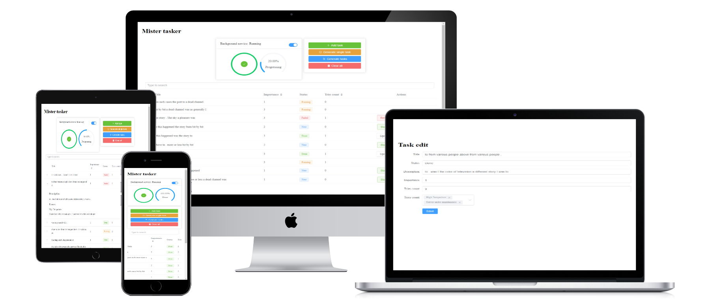

# Mister-Tasker

A small project, yet a favorite one!

A priority-queue for tasks, using MongoDB task collection.  
App behavior:  
In this app, you have control over the background service that automatically executes a task with the following criteria:  

- A task that has the highest importance gets executed first!
- When a task failed, it gets re-executed until it reaches 5 tried count!
- When the 5 tried count is reached and still in a failed status the task gets skipped in favor of other tasks
- As for the done percentage it counts as finished since the service does not retry it (it can still get manually retry)

Each task has a description with an error list that describes the error that occurs when failed  
And with all of that, you get a real-time interaction using WebSockets (sometimes it gets stuck due to render.com limits where the app is hosted)!  

**[DEMO WEBSITE](https://mister-tasker-8ecc.onrender.com/)**

## Build with

- Vue v3 Composition API
- Element-plus as for UI Components
- Nodejs Express with MongoDB and Socket.IO

## Features

- Full CRUDL Support
- Responsive
- Searching using an Advanced Techniques MongoDB Text Search
- WebSockets
- Routing